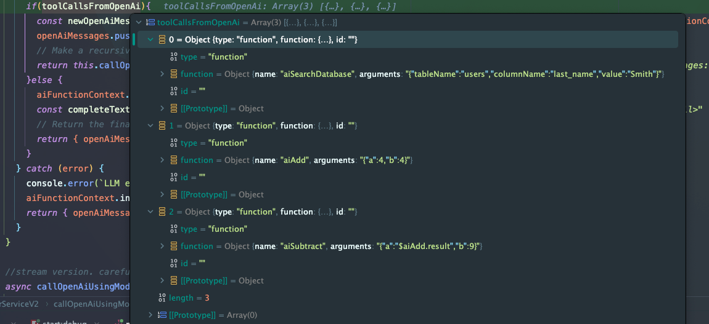

# AI Agents Approach

## Tool Calls
### Planner/Executor Architecture

### Tool Call Hallucinations
Tool calls often contain hallucinations, especially with smaller parameter models.

#### Example Hallucination

For example, sending only calculator tools, then asking a QWEN 2.5 7B 1Million Context Q4_K_M gguf model:
`search the web for bitcoin news, then add 4 + 4, and subtract 9 from the result, and send that to john@gmail.com`

Will often result in the appropriate calculator tools being called, but also include calls to a non-existent webSearch function.


```javascript
const openAiMessages: ChatCompletionMessageParam[] = [
  {role: 'system', content: `
        You are a general purpose assistant that responds to user requests.
        
        # Tools (aka functions)
        Additionally, you have been provided with tools/functions that you can potentially use to respond to a user request.  
       
        ## Tool Usage
        Spend time deeply reasoning about the tools you have been provided, and be extremely not to attempt to use tools that haven't been explicitly defined.
        It is extremely important that you do not invent tools/functions, and it will cause a great deal of harm if you do.
         
        ## Tool Execution
        Follow these guidelines exactly:
        - All tool calls made by you should be done in ONE response.  ie. You should call all tools needed for a user prompt directly after a user prompt is received.
        - Since all tool calls must happen at once, when a tool call depends on the result of a previous tool call, use parameter referencing syntax \`$functionName.result\` for dependencies.
        
        ### Example of a good tool execution flow
        user prompt: "find the email address for member id 1, then send them a welcome email"
        your response: 2 tool calls in a single response.
          1. {name: "findEmail", params: { memberId: 1} }
          2. {name: "sendEmail", params: { email: "$findEmail.result", body: "Welcome!" }
        
        ### Example of a bad tool execution flow
        user prompt: "find the email address for member id 1, then send them a welcome email"
        your response: 1 tool call in the first response.
          1. {name: "findEmail", params: { memberId: 1} }
        client: sends result of findEmail back to you
        your response: 1 tool call in the second response  
          1. {name: "sendEmail", params: { email: "jack@gmail.com", body: "Welcome!" }
        
        # Final guidance
        If no tools are applicable, simply respond as you normally would to any other request.
        For example, if the user asks you who George Washington is, and there isn't a webSearch or biography tool, you would simply respond with information you know about George Washington.
        
        `},
  {role: 'user', content: prompt}
];
return openAiWrapperService.callOpenAiUsingModelAndSubject({openAiMessages, aiFunctionContext, model, totalOpenAiCallsMade: 0});
}

const result6 = await askBot("search the web for bitcoin news, then add 4 + 4, and subtract 9 from the result, and send that to john@gmail.com");
expect(result6.completeText !== undefined).toBe(true);
```
